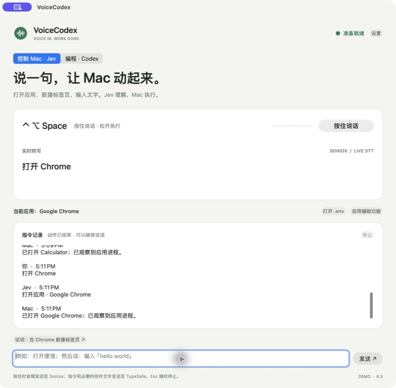

# VoiceCodex

**Hold a key. Say what you need. Control your Mac.**

A native macOS voice controller with two modes: **Jev** selects native Mac actions, and **Codex** continues your coding session in Terminal. Soniox provides live Chinese / English transcription. Hold the shortcut from another app and release to execute.



## Control your Mac with Jev

Inspired by [this Jev voice-control demo](https://www.youtube.com/shorts/vSzde5be5XE). The app uses TypeSafe's Jev API directly from Swift; no Node service, generated scripts, or Codex login is needed in Mac mode.

1. Build and open the app with `./script/build_and_run.sh --install`.
2. Choose **控制 Mac · Jev** and click **打开 .env**. Fill `TYPESAFE_API_KEY` with your TypeSafe key. The default model is pinned to `jev-1.13.0`. Save the file; the next command reloads it.
3. Set a Soniox key in Settings, or set `SONIOX_API_KEY` in `.env`. An existing saved Soniox key is reused when the `.env` value is blank.
4. Click **启用辅助功能** and enable VoiceCodex in macOS System Settings. Microphone access is requested on first recording.
5. Hold **Control + Option + Space**, say one action, and release. **Esc** stops recording or further Mac actions. The text field uses the same Jev execution path.

Try these commands, one at a time:

| Say | Action |
| --- | --- |
| “打开 Chrome” / “Open Calculator” | Open or activate an installed app |
| “在 Chrome 新建一个标签页” | Send ⌘T to Chrome |
| “打开便笺” → “新建一个窗口” | Open Stickies, then create a note |
| “输入「hello world」” / “Type hello world” | Insert your literal text at the focused editor's selection |
| “向下滚动” / “复制” / “撤销” | Operate the captured target app |
| “点击保存按钮” | Choose from observed, enabled Accessibility controls |
| “关闭 Chrome 的所有窗口” | Review, then close observed windows; stop at a save dialog |

Jev chooses from a fixed action vocabulary and observed app/control IDs. It does not generate prose, scripts, shell commands, or text to type. Say one operation per command; compound research/writing workflows are not implemented in Mac mode. Typing preserves the rest of an editable field and does not press Return. Protected fields and terminal input are blocked. Apps that do not expose usable Accessibility controls may need a manual click first.

The target for an unnamed app is captured when recording starts. Named apps can be selected explicitly. Return, paste, clicking a control, and closing all windows have an in-app review step. A cancellation stops later actions; it does not undo input already delivered. Receipts distinguish observed changes from shortcuts whose final effect cannot be verified.

### Local `.env`

The installed app defaults to `~/Library/Application Support/VoiceCodex/.env`. Use **打开 .env** to create/open it with private file permissions. For a development launch, `.env` in the working directory or `VOICECODEX_ENV_FILE` can override it. `.env.example` is a template only; no key is bundled.

```dotenv
TYPESAFE_API_KEY=
TYPESAFE_DEFAULT_MODEL=jev-1.13.0
SONIOX_API_KEY=
```

Precedence is saved settings → Application Support `.env` → selected development `.env` → process environment. Blank key values preserve an existing key. Parsing is literal: no shell execution or variable expansion. Never commit real `.env` files. See [Jev integration details](docs/jev.md).

## Codex coding mode

- Global **Control + Option + Space** push-to-talk (Control + Shift + Space fallback if occupied).
- Live Chinese / English transcription with Soniox's streaming WebSocket API.
- A floating recording indicator, live transcript, and microphone level.
- Automatic submission on release; **Esc** cancels the current recording.
- One independent Git worktree per new task, based on the selected checkout's committed HEAD.
- Explicit Codex session IDs for follow-up instructions; new instructions queue while Codex runs.
- A visible, interactive Codex session in **Terminal.app**, text-input fallback, and a stop button.

This is an early demo. Release the shortcut to send your instruction to a real Codex TUI in Terminal. Its output, tool calls, approval prompts, and replies appear there. You can also type directly in that terminal. Closing the VoiceCodex window leaves the menu-bar app running. Open VoiceCodex again from Finder or Spotlight to restore that same window; the menu-bar menu also has an Open VoiceCodex action.

## Run

Requires macOS 14+, Xcode Command Line Tools / Swift 5.9+, and a [Soniox API key](https://console.soniox.com/) for speech. Mac mode also needs a TypeSafe API key; coding mode needs an installed, authenticated [Codex CLI](https://developers.openai.com/codex/cli/).

```sh
git clone https://github.com/Singularity-tian/voicecodex.git
cd voicecodex
./script/build_and_run.sh --install
```

Terminal mode requires a CLI with `--remote` and the app-server queue API; tested with **Codex CLI 0.153.2**.

The script builds a local app bundle, signs it ad hoc, installs it at `~/Applications/VoiceCodex.app`, and launches it. It is a source-built demo, not a notarized distribution.

Developers with a signing certificate can set `VOICECODEX_SIGNING_IDENTITY` to their own identity when building. A stable signing identity avoids repeated permission resets as the app changes.

1. Open **设置**, enter your Soniox key and check the Codex executable path. VoiceCodex reuses your existing `codex login` authentication.
2. Click **选择项目** and pick a Git repository with at least one commit.
3. Hold **⌃⌥Space**, allow the microphone on first use, then hold again and speak.
4. Release to open **Terminal** and run. Complete any first-run Codex prompts in the terminal. Subsequent voice instructions go to that same session. Choose **新任务** to start fresh.
5. Use **打开终端** to return to Terminal. Full output and any approval questions stay there; the app shows your submitted instructions and connection state.

macOS may also request access to the folder containing your selected project. Allow that request to let Git read the repository; if a task times out while waiting for permission, allow access and retry.

You can also hold the **按住说话** button, or type a prompt in the bottom field and press Return.

### 中文快速开始

打开设置填入 Soniox API key，选择一个 Git 项目。按住 **Control + Option + Space** 说话，松手后自动交给 Codex；**Esc** 取消录音。第一次需要允许麦克风，授权后再次按住开始。

松手后自动打开 macOS **Terminal**，运行真正的交互式 Codex。完整执行过程、工具输出、确认提示和回复都在终端显示，也可以直接键入。点 **打开终端** 随时切回。

新任务从项目已提交的 HEAD 创建独立 worktree。原目录中未提交的改动不会自动复制。继续说话会沿用同一个会话；Codex 正忙时，新指令进入队列。关闭 Terminal 后，再次说话会恢复原会话；选择新任务会结束旧的终端连接，保留工作目录。关闭 VoiceCodex 窗口仍可用全局快捷键；再次从 Finder 或 Spotlight 打开 VoiceCodex，会恢复原窗口和会话。菜单栏也有「打开 VoiceCodex」入口。从菜单栏退出应用会停止它管理的 Codex 服务。

## Local data and permissions

- Audio is captured only for an explicit recording and streamed to **Soniox**. VoiceCodex keeps audio in memory and does not save recordings.
- The app waits for Soniox's final completion response. A network or transcription error does not execute a partial transcript.
- Final text is sent to **Codex**, using the account and provider configuration already configured for your CLI.
- In Mac mode, final text and app names/identifiers are sent to **TypeSafe**. A click command additionally sends bounded Accessibility role/title/description text for the selected window. Screenshots, clipboard contents, and whole documents are not sent to Jev. Transcripts and action receipts are saved privately in `mac-history.txt`, separately from the coding session history.
- Settings, the Soniox credential, session IDs, and local transcript/output history live in `~/Library/Application Support/VoiceCodex/`. Config and history files use mode `0600`.
- Task worktrees live under that directory's `worktrees/`. They are preserved when you start a new task; remove finished ones with `git worktree remove` when ready.
- The Soniox key is used by the voice app and is not added to the Codex child-process environment. `SONIOX_API_KEY` is also supported for explicitly configured development launches.
- The TypeSafe key is likewise removed from managed Codex child-process environments. Neither key appears in command arguments.
- The interactive TUI runs with `-a on-request`, `--sandbox workspace-write`, and `--no-alt-screen` to keep terminal scrollback. Approval prompts appear in Terminal. Tool-specific and macOS permissions still apply; Terminal mode does not grant access to a blocked app.
- Each active VoiceCodex connection uses its own Codex app-server bound to `127.0.0.1`, protected by a random bearer token in a private local file. It does not replace or restart any existing Codex daemon. The Terminal launcher reads that token into a named environment variable; it is not embedded in the launch script or command arguments.
- Stop clears pending instructions and requests interruption of the active turn; the terminal remains available for another instruction. Closing its Terminal session, starting a new task, or quitting VoiceCodex shuts down the server owned by the app. Already-completed edits remain; detached child processes are not independently managed by this demo.

Do not put real API keys in the repository or bundle. Other users must supply their own credential; no shared public key is included.

## Development

```sh
swift test
./script/build_and_run.sh --build-only
./script/build_and_run.sh --verify
```

The Codex app's Run action calls `script/build_and_run.sh`. Other modes include `--logs`, `--telemetry`, and `--debug`.

| Component | Responsibility |
| --- | --- |
| `GlobalHotkey` | Carbon global press/release events |
| `RealtimeSTT` | AVAudioEngine capture, PCM conversion, Soniox streaming and finalization |
| `JevClient` | Typed action/app/control selection, confidence and response validation |
| `MacControlDriver` | Native app activation, targeted input, bounded AX reads and receipts |
| `EnvironmentFile` | Literal `.env` parsing without shell execution |
| `AppController` | Recording lifecycle, prompt queue, session selection and local state |
| `TerminalSession` | Authenticated local app-server, literal JSON prompts, queue, status and interruption |
| `TerminalLauncher` | Private launch files for a real Codex TUI in Terminal.app |
| `CodexRunner` | Original non-interactive runner, retained as a tested core utility |
| `WorkspaceManager` | Git worktree creation without modifying the source checkout |

Voice and typed prompts are sent as literal JSON over the authenticated local WebSocket, never interpolated into shell source. Terminal is opened using macOS application APIs; no simulated typing or AppleScript Automation permission is required. The STT adapter uses a documented public protocol; see [the Soniox integration notes](docs/soniox.md).

## License

MIT. Independent community project; not affiliated with OpenAI or Soniox.
